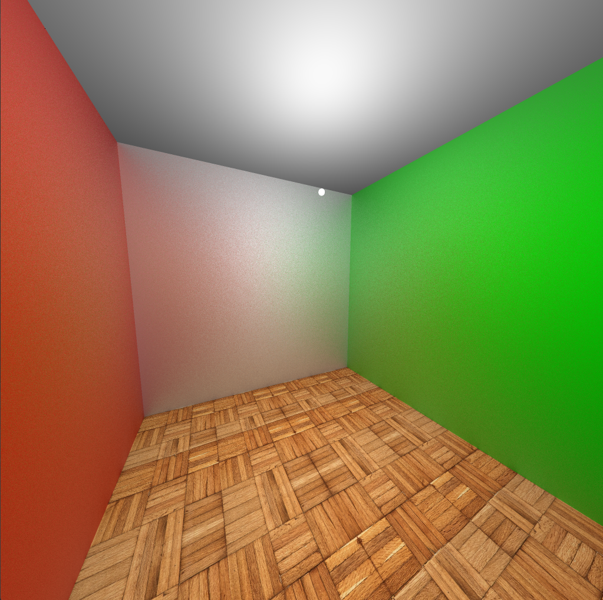
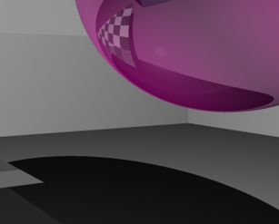

# CUDA Ray Tracer

A high-performance GPU-accelerated ray tracing renderer built with CUDA, supporting photorealistic rendering with advanced lighting simulation, material properties, and normal mapping.

## Features

- **GPU-Accelerated Rendering**: Leverages CUDA for real-time ray tracing computation
- **Advanced Lighting**: Realistic direct light simulation with shadow casting
- **Material System**: Support for multiple material types (diffuse, specular, glossy)
- **Normal Mapping**: Enhanced surface detail with normal map support
- **Texture Support**: Texture mapping with customizable UV coordinates
- **OBJ Model Loading**: Import complex 3D models from OBJ files
- **BVH Acceleration**: Bounding Volume Hierarchy for efficient ray-scene intersection testing
- **Anti-Aliasing**: Supersampling Anti-Aliasing (SSAA) support for smoother results
- **Reflections**: Multi-bounce reflection support with configurable reflection depth
- **Real-Time Interaction**: Mouse and keyboard controls for camera movement and rendering adjustments

## Project Structure

```
renderer/
├── kernel.cu              # Main entry point and scene setup
├── engine.cuh            # Core rendering engine
├── renderer.cuh          # Ray tracing and lighting calculations
├── scene.cuh             # Scene management and data structures
├── bvh.cuh               # BVH acceleration structure
├── objects.cuh           # Object definitions and geometry primitives
├── light.cuh             # Light sources and illumination
├── material.cuh          # Material properties and surface types
├── texture.cuh           # Texture management and sampling
├── normal.cuh            # Normal mapping implementation
├── physics.cuh           # Physics calculations and ray intersection
├── algebra.cuh           # Vector and matrix mathematics
├── obj_loader.cuh        # OBJ file parsing and loading
└── settings.cuh          # Configuration and runtime settings
```

## Rendering Progress

### Early Development


### OBJ Model Loading


### Material System & Reflections


### Normal Mapping



### Lighting Simulation


### BVH Acceleration


### Anti-Aliasing




## Requirements

- **NVIDIA GPU** with CUDA Compute Capability 3.0 or higher
- **CUDA Toolkit** (11.0 or later recommended)
- **Visual Studio** 2019 or later (for Windows development)
- **SDL2** library for window management and input handling

## Building

The project uses Visual Studio and CUDA. Open `renderer.sln` and build the solution:

```
- Configuration: Debug or Release
- Platform: x64
```

## Controls

| Key | Action |
|-----|--------|
| `W/A/S/D` | Move camera forward/left/backward/right |
| `E` | Move camera up |
| `Q` | Move camera down |
| `Mouse` | Look around |
| `H` | Enable high-quality rendering (SSAA x4) |
| `L` | Toggle light movement mode |

## Configuration

Modify `settings.cuh` to adjust:
- Camera movement speed
- Mouse sensitivity
- Quality settings

Modify `kernel.cu` to:
- Load different OBJ models
- Adjust light positions and colors
- Configure material properties
- Change scene layout

## Performance Notes

- Rendering performance depends on scene complexity and GPU capabilities
- Enable SSAA for better quality at the cost of performance
- The BVH acceleration structure significantly improves performance on complex scenes

## Future Improvements

- Global illumination
- Caustics simulation
- Volumetric rendering
- Adaptive sampling
- Denoising

## License

[Add your license information here]

